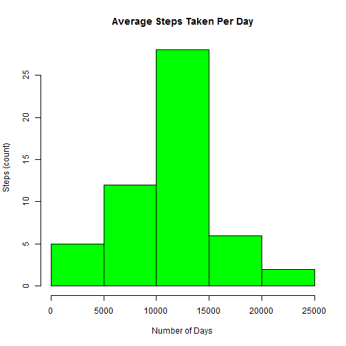
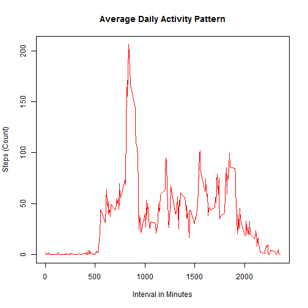
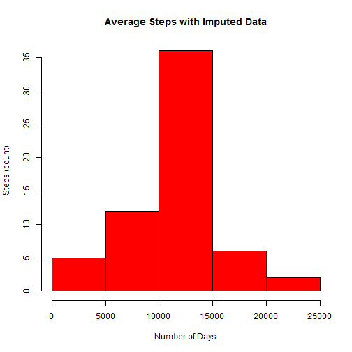
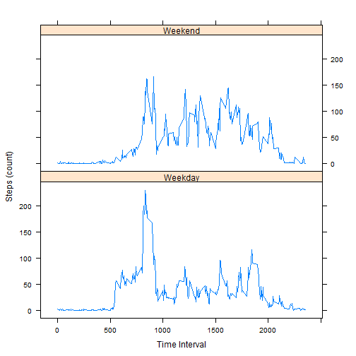

# **Reproducible Research**
## **Peer Assessment: 1**
### *By: Aditya (Me)*

Starting by reading files:


```r
data <- read.csv("activity.csv", header = T, nrows = 17568,
                 colClasses = c("numeric", "character", "numeric"))
str(data) ## Checking the data
```

```
## 'data.frame':	17568 obs. of  3 variables:
##  $ steps   : num  NA NA NA NA NA NA NA NA NA NA ...
##  $ date    : chr  "2012-10-01" "2012-10-01" "2012-10-01" "2012-10-01" ...
##  $ interval: num  0 5 10 15 20 25 30 35 40 45 ...
```

Now, proceeding to process the date:


```r
data$date <- as.Date(data$date, format = "%Y-%m-%d")
str(data) ## checking the data structure
```

```
## 'data.frame':	17568 obs. of  3 variables:
##  $ steps   : num  NA NA NA NA NA NA NA NA NA NA ...
##  $ date    : Date, format: "2012-10-01" "2012-10-01" ...
##  $ interval: num  0 5 10 15 20 25 30 35 40 45 ...
```

Now, proceeding to calculate the total number of steps taken per day


```r
t_steps <- aggregate(steps~date, data, FUN = sum)
str(t_steps)
```

```
## 'data.frame':	53 obs. of  2 variables:
##  $ date : Date, format: "2012-10-02" "2012-10-03" ...
##  $ steps: num  126 11352 12116 13294 15420 ...
```

Now, to generate the histogram from above data, we run the following:


```r
hist(t_steps$steps, main = "Average Steps Taken Per Day",
     xlab = "Number of Days",
     ylab = "Steps (count)", col = "green")
```

 

Now, calculating mean and median from table above, NA values are ignored


```r
X1 <- mean(t_steps$steps, na.rm = T)
X2 <- median(t_steps$steps, na.rm = T)
df_summ1 <- data.frame("Mean" = X1, "Median" = X2, row.names = "Steps")
df_summ1
```

```
##           Mean Median
## Steps 10766.19  10765
```

Now, average of steps taken by 5 minutes interval:


```r
i_steps <- aggregate(steps~interval, data, FUN = mean, na.rm = T)
str(i_steps)
```

```
## 'data.frame':	288 obs. of  2 variables:
##  $ interval: num  0 5 10 15 20 25 30 35 40 45 ...
##  $ steps   : num  1.717 0.3396 0.1321 0.1509 0.0755 ...
```

```r
## Now, plotting a histogram with the average steps by 5-minutes
## interval obtained above
with(i_steps, {plot(x = interval, y = steps, 
                    main = "Average Daily Activity Pattern",
                    xlab = "Interval in Minutes", 
                    ylab = "Steps (Count)", col = "red", type = "l")})
```

 

Now, finding the 5-minute interval with maximum number of steps:


```r
i_steps[order(i_steps$steps, decreasing = T)[1],]
```

```
##     interval    steps
## 104      835 206.1698
```

The total number of missing values in the dataset is below:


```r
NA_count <- sum(is.na(data)) ## count of NA values
NA_count
```

```
## [1] 2304
```

Now, replacing the 2304 NA values with mean for the
respective 5-minutes interval:


```r
datanew <- data ## making a copy of the original dataset
datanew$steps[is.na(datanew$steps)] <- i_steps$steps
## Imputed the NA values with mean calulated before
str(datanew)
```

```
## 'data.frame':	17568 obs. of  3 variables:
##  $ steps   : num  1.717 0.3396 0.1321 0.1509 0.0755 ...
##  $ date    : Date, format: "2012-10-01" "2012-10-01" ...
##  $ interval: num  0 5 10 15 20 25 30 35 40 45 ...
```

```r
sum(is.na(datanew$steps)) ## checking for NA values
```

```
## [1] 0
```

Now, the above dataset can be used to recalculate the number of
steps taken per day and construct a new histogram:


```r
impusteps <- aggregate(steps~date, datanew, FUN = sum)
## Now, plotting a new histogram of the above data:
hist(impusteps$steps,
     main = "Average Steps with Imputed Data",
     xlab = "Number of Days", ylab = "Steps (count)", col = "red")
```

 

Now, mean and median with the imputed data can be calculated:

```r
Y1 <- mean(impusteps$steps, na.rm = T)
Y2 <- median(impusteps$steps, na.rm = T)
df_summ2 <- data.frame("Mean" = Y1, "Median" = Y2, row.names = "Steps")
df_summ2
```

```
##           Mean   Median
## Steps 10766.19 10766.19
```

As we can see, the mean and median calculated here is slightly different from the mean and median with NA values from earlier:

**Original:**
*Mean: 10766.19*       
*Median: 10765*

**New:**
*Mean: 10766.19*     
*Median: 10766.19*

Now, proceeding to classify the dates given as "weekdays" and "weekends". A new column named "daytype" will be added to the dataset in this process:


```r
datanew$daytype <- as.factor(ifelse(weekdays(datanew$date) %in% c("Saturday", "Sunday"), "Weekend", "Weekday"))
str(datanew)
```

```
## 'data.frame':	17568 obs. of  4 variables:
##  $ steps   : num  1.717 0.3396 0.1321 0.1509 0.0755 ...
##  $ date    : Date, format: "2012-10-01" "2012-10-01" ...
##  $ interval: num  0 5 10 15 20 25 30 35 40 45 ...
##  $ daytype : Factor w/ 2 levels "Weekday","Weekend": 1 1 1 1 1 1 1 1 1 1 ...
```

Now the above dataset can be used to plot the graph of steps by interval for weekend and for weekdays. The package "lattice" must be used here:


```r
## Calculating the total steps grouped by weekdays and interval:
d_steps <- aggregate(steps ~ daytype + interval, datanew, FUN = mean)
## Now using the above data to plot the graph:
library("lattice")
xyplot(steps~interval|daytype, type = "l", d_steps, layout = c(1,2), xlab = "Time Interval", ylab = "Steps (count)")
```

 

The above graph has two levels showing count of average steps by time interval


